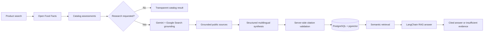
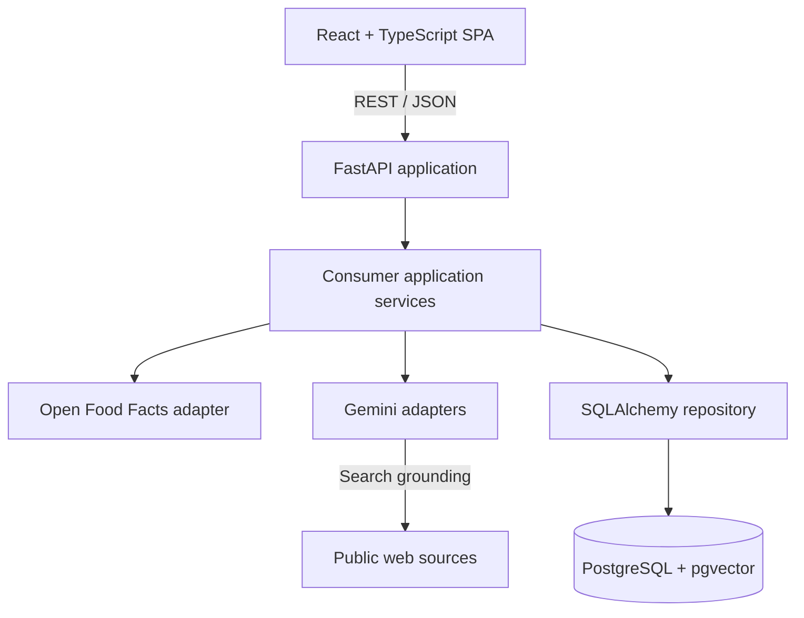

# JustSupply

**Evidence-first product research for more informed purchasing decisions.**

JustSupply is a multilingual consumer application that helps people investigate the ethical and
environmental context behind everyday products. A user can search by product name, brand, or
barcode, inspect the product photo, and review separate findings about vegan composition,
environmental impact, women in the workforce, and the inclusion of historically excluded groups.

The project combines structured product data, live public-web research, and retrieval-augmented
generation (RAG). Its central principle is simple: an AI-generated statement is not evidence by
itself. Every meaningful conclusion must show where it came from, how strong its support is, and
what remains unknown.

> JustSupply does not certify products or declare a universal "best" choice. It organizes public
> evidence so that consumers can make decisions according to their own priorities.

## Why this project exists

Labels such as *vegan*, *sustainable*, or *inclusive* are useful, but they rarely tell the whole
story. Relevant information is fragmented across product databases, certification registries,
company disclosures, NGO reports, regulators, and journalism. Social and environmental claims may
also be incomplete, outdated, broad enough to apply only to a brand, or supported exclusively by
the company making the claim.

JustSupply was created to make that uncertainty visible instead of hiding it behind an opaque
score. The application is designed around four motivations:

- make public evidence easier for non-specialists to inspect;
- separate product facts from brand-level policies and disclosures;
- distinguish a documented concern from information that is simply unavailable;
- use generative AI for research and explanation without treating model output as a source.

## What users can do

1. Search for a food product by name, brand, or 8–14 digit barcode.
2. See its catalog identity, brand, package image, update date, and evidence coverage.
3. Review independent assessment cards for:
   - vegan composition;
   - environmental impact;
   - employment and advancement of women;
   - inclusion of minorities and historically excluded groups.
4. Start an on-demand Gemini research run for a selected product and brand.
5. Open every cited public source and inspect limitations attached to each finding.
6. Ask a specific question through a RAG assistant that answers only from retrieved evidence.
7. Use the entire experience in English, Brazilian Portuguese, or Latin American Spanish.

English is the default language. The language selector is always available in the header, and the
preference is remembered locally. A single research run creates all three localized versions, so
changing the interface language does not repeat the web research or consume another research
request. Source titles and excerpts remain in their original language to preserve provenance.

## How evidence is presented

JustSupply deliberately avoids a single ethical score. Each dimension has its own status:

| Status | Meaning |
| --- | --- |
| `supported` | Available evidence supports the finding. |
| `mixed` | Sources or indicators point in different directions. |
| `concern` | A cited source documents a relevant concern. |
| `not_disclosed` | Direct public disclosure was not found. |
| `unknown` | Available data is insufficient to reach a conclusion. |

Every result also communicates its evidence scope and verification level:

- **Product-level evidence** concerns that specific formulation, package, or certification.
- **Brand-level evidence** concerns policies, employment, leadership, or company-wide reporting.
- **Catalog data** comes from the community-maintained Open Food Facts database.
- **Single source** means corroboration is limited.
- **Multiple sources** indicates broader public support.
- **Unverified** means no valid public source was attached to the claim.

Missing disclosure is never converted into evidence of wrongdoing, and a general brand or regional
risk is never presented as proof about a specific product.

## Environmental research

The first environmental signal comes from the Open Food Facts Green-Score when it is available.
The optional Gemini research then looks for product- or brand-relevant public evidence involving:

- deforestation and land-use risk;
- climate and greenhouse-gas impact;
- water use and water-related risks;
- packaging and recyclability;
- sustainability commitments and independently documented progress;
- supply-chain origin and traceability.

When no product-specific evidence exists, JustSupply reports that limitation instead of inferring a
negative conclusion from a country, commodity, or industry-level risk.

## AI and RAG design

The AI workflow uses two distinct stages so that collection and interpretation remain auditable.



### Grounded research

Gemini uses Google Search grounding to collect current public sources. JustSupply then makes a
second structured-output request that produces exactly four assessment dimensions. The server,
not the model, enforces the trust rules:

- positive, mixed, or concern findings require at least one valid source reference;
- source numbers outside the grounded result are discarded;
- uncited assertions are downgraded to `unknown` or `not_disclosed`;
- product and brand scopes remain explicit;
- evidence limitations are stored with the claim;
- research is cached for seven days by default.

### Evidence-grounded questions

Grounded passages are embedded with `gemini-embedding-2` using 1,536-dimensional vectors and stored
in PostgreSQL through pgvector. For each question:

1. the question is embedded in the selected language;
2. cosine similarity retrieves evidence from the latest research run for that product;
3. a LangChain runnable provides only those passages to Gemini;
4. the generated response must cite retrieved evidence as `[1]`, `[2]`, and so on;
5. the server rejects citation numbers outside the retrieved context;
6. a response with no valid support becomes an explicit insufficient-evidence result.

LangChain is kept behind an integration adapter. Business rules, citation validation, persistence,
and trust decisions remain ordinary application code, making them easier to test and reducing
framework lock-in.

## Architecture



The backend follows clear boundaries:

- **API routes** handle HTTP validation and status-code mapping.
- **Application services** coordinate search, assessment, research, and RAG use cases.
- **Integration adapters** isolate Open Food Facts, Gemini, embeddings, and LangChain.
- **Repositories** own persistence queries and transaction boundaries.
- **Pydantic schemas and domain types** define contracts between layers.
- **Alembic migrations** version the PostgreSQL and pgvector schema.

The evidence model stores products, brands, claims, public sources, evidence records, research runs,
and claim-to-evidence relationships separately. This retains provenance and allows one source to
support multiple conclusions without copying it into an opaque response payload.

## Engineering highlights

This project demonstrates practical full-stack and AI engineering skills, including:

- a typed REST API with FastAPI, Pydantic, and dependency injection;
- a responsive React 19 and TypeScript interface;
- server-state synchronization and mutations with TanStack Query;
- PostgreSQL persistence with SQLAlchemy and versioned Alembic migrations;
- vector storage and HNSW cosine-similarity search with pgvector;
- Gemini structured outputs, embeddings, and Google Search grounding;
- RAG orchestration through LangChain Core without coupling domain rules to the framework;
- defensive citation validation and explicit insufficient-evidence behavior;
- prompt-injection-aware separation of instructions and untrusted product/evidence content;
- multilingual UI, stored AI findings, locale-aware dates, and locale-aware RAG answers;
- adapters and test doubles for deterministic unit tests;
- PostgreSQL integration tests for persistence and vector retrieval;
- static typing, automated formatting, linting, unit tests, and production frontend builds.

## Technology stack

| Area | Technologies |
| --- | --- |
| Frontend | React 19, TypeScript, Vite, React Router, TanStack Query |
| Backend | Python 3.14, FastAPI, Pydantic, SQLAlchemy |
| AI | Gemini API, Google Search grounding, structured outputs, Gemini Embeddings |
| RAG | LangChain Core, pgvector, HNSW cosine similarity |
| Data | PostgreSQL 18, Alembic, Open Food Facts |
| Quality | pytest, MyPy strict mode, Ruff, Vitest, Testing Library, oxlint |
| Local infrastructure | Docker Compose |

## API overview

| Method | Endpoint | Purpose |
| --- | --- | --- |
| `GET` | `/health` | Service health check. |
| `GET` | `/api/v1/consumer/products` | Search by product, brand, or barcode and return cached evidence. |
| `POST` | `/api/v1/consumer/products/{barcode}/research` | Run or reuse grounded Gemini research. |
| `POST` | `/api/v1/consumer/products/{barcode}/ask` | Retrieve evidence and generate a cited answer. |

Search and research accept `language=en`, `language=pt-BR`, or `language=es-419`. The question
request body accepts the same `language` field. Use `refresh=true` on the research endpoint to
bypass a fresh cached result.

Interactive API documentation is available at `http://127.0.0.1:8000/docs` while the backend is
running.

## Run locally

### Prerequisites

- Python 3.14;
- Node.js and npm;
- Docker Desktop;
- a Gemini API key for research and RAG features.

Catalog search remains available without Gemini, while AI research and questions return a clear
configuration error.

### 1. Configure the environment

```powershell
Copy-Item .env.example .env
```

Add the Gemini key only to the local `.env` file:

```dotenv
GEMINI_API_KEY=your-key-here
```

Never commit `.env` or expose the key to the frontend.

### 2. Install the backend

Activate the virtual environment and run:

```powershell
python -m pip install --editable ".[dev]"
```

### 3. Start PostgreSQL and apply migrations

```powershell
docker compose up -d database
python -m alembic upgrade head
```

The local PostgreSQL service is exposed on port `5433` to avoid a common conflict with locally
installed PostgreSQL instances.

### 4. Start the API

```powershell
python -m uvicorn justsupply.main:app --reload
```

### 5. Start the frontend

In another terminal:

```powershell
Set-Location frontend
npm install
npm run dev
```

Open `http://localhost:5173`.

## Quality checks

Backend:

```powershell
python -m ruff format --check backend
python -m ruff check backend
python -m mypy backend\justsupply
python -m pytest backend\tests
```

PostgreSQL and pgvector integration test:

```powershell
$env:RUN_DATABASE_TESTS = "1"
python -m pytest backend\tests\integration
Remove-Item Env:RUN_DATABASE_TESTS
```

Frontend:

```powershell
Set-Location frontend
npm test -- --run
npm run lint
npm run build
```

## Current scope and next steps

The current MVP focuses on food-product discovery and evidence-backed explanations. Likely next
steps include broader product catalogs, dedicated certification-registry integrations, richer
environmental dimensions, automated evaluation datasets for retrieval and grounded answers,
authentication, observability for model latency and cost, CI/CD, and public deployment.

The architecture intentionally keeps the evidence model broader than food so that future modules
for cosmetics, household products, clothing, and electronics can reuse the same provenance and RAG
foundations.

## Data and AI responsibility

- Open Food Facts is community maintained and may be incomplete or outdated.
- Public web sources can conflict or describe only a brand-level policy.
- Gemini summarizes evidence but is never stored as the source of its own claim.
- JustSupply displays uncertainty and source limitations instead of concealing them.
- Consumers should inspect the original sources before making important decisions.

Official references:

- [Open Food Facts API documentation](https://openfoodfacts.github.io/documentation/docs/Product-Opener/api/)
- [Open Food Facts product schema](https://openfoodfacts.github.io/documentation/docs/Product-Opener/schemas/schemas/product/)
- [Gemini grounding with Google Search](https://ai.google.dev/gemini-api/docs/google-search)
- [Gemini embeddings](https://ai.google.dev/gemini-api/docs/embeddings)
