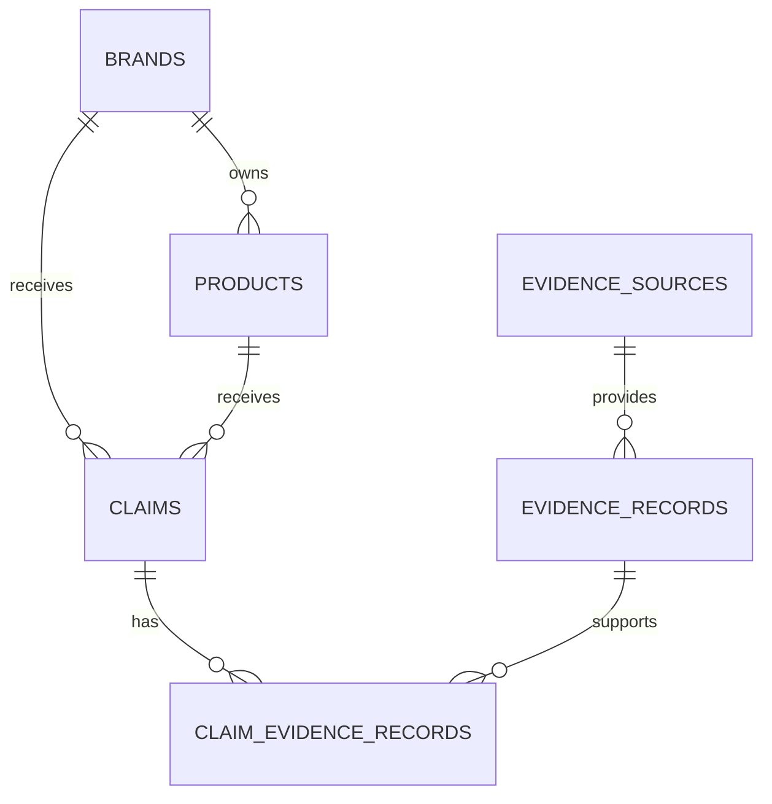

# JustSupply

JustSupply is an evidence-based due diligence platform for small vegan brands and ethical procurement teams. Its purpose is to help these organizations understand not only whether a product is vegan, but also what evidence exists about its supply chain and what information is still missing.

## Problem

A claim such as "vegan" does not, by itself, establish whether a supply chain respects women, workers, communities, animals, and ecosystems. Supplier documents may also be incomplete, outdated, contradictory, or supported only by unverified statements.

JustSupply will organize this information without producing an arbitrary ethical score. Every conclusion should identify its source, location within the document, evidence quality, freshness, and human review status.

## Current MVP focus

The first public-facing version is **JustSupply Consumer**. A shopper can search by product
name, brand name, or barcode and receive separate evidence findings for:

- vegan composition;
- environmental impact;
- women workers;
- the inclusion of historically excluded people.

The application does not collapse these dimensions into an arbitrary ethical score. Each
finding communicates whether evidence supports a claim, raises a concern, is mixed, is unknown,
or has not been disclosed. It also distinguishes product-level evidence from brand-level gaps.

Open Food Facts currently supplies product identity, ingredient analysis, and Green-Score data.
Women-worker and minority-inclusion findings remain explicitly marked as not disclosed until
JustSupply integrates suitable evidence sources. Missing information is never presented as proof
of harmful practice.

## Shared platform vision

The evidence platform supports two interfaces that will continue to evolve:

- **JustSupply Consumer:** product, brand, and barcode search with evidence-based explanations;
- **JustSupply Pro:** supplier records, AI-assisted document ingestion, due diligence, and human
  evidence review.

Both interfaces should use the same evidence base while preserving the distinction between product-level, brand-level, supplier-level, and commodity-region risk information.

## Evidence model

Consumer catalog results are persisted as an evidence graph instead of being stored as one opaque
API response:



A database constraint requires every claim to belong to exactly one product or one brand. Evidence
records are deduplicated by a fingerprint while the join table allows the same evidence to support
more than one claim in future ingestion and RAG workflows.

Social evidence follows a human-review workflow:

1. an analyst selects a known brand and records a narrow finding with its source;
2. the new claim remains `pending` and is not visible to consumers;
3. an analyst approves or rejects the claim;
4. only an `approved` claim replaces the corresponding `not_disclosed` Consumer result.

Uploaded documents add a second, AI-assisted path:

1. an analyst uploads a PDF, UTF-8 text file, or Markdown file and records its public source;
2. the backend extracts readable text locally and sends that text to the configured OpenAI model;
3. Structured Outputs restrict the response to validated social-evidence fields;
4. JustSupply discards any suggested excerpt that cannot be found in the extracted document text;
5. every remaining AI finding enters a separate pending review queue;
6. approving a finding publishes it through the same claim, source, and evidence model used by
   manually entered evidence.

The database stores the model name, prompt version, provider response identifier, source-document
hash, extracted finding, and review decision. This audit trail is intentional: an AI response is a
proposal for review, never evidence by itself.

The same uploaded documents now power a retrieval-augmented generation workflow:

1. readable text is split into deterministic, overlapping chunks while PDF page numbers are kept;
2. OpenAI embeddings convert every chunk into a 1,536-dimensional vector;
3. PostgreSQL stores the chunks in pgvector and uses an HNSW cosine-distance index;
4. a question is embedded and the nearest chunks for the selected brand are retrieved;
5. a LangChain runnable coordinates retrieval and grounded answer generation;
6. the server accepts only citations that point to chunks in the retrieved context;
7. an answer without at least one valid citation becomes an `insufficient_evidence` response.

LangChain is deliberately confined to an integration adapter. Chunking, evidence rules, citation
validation, retrieval metrics, and repository contracts remain ordinary JustSupply code, so the
business layer can be tested or moved to another orchestration framework without being rewritten.

The Pro review endpoints do not have authentication yet and are intended for local development
only. Authentication and reviewer identity must be implemented before public deployment.

## Planned architecture

- Backend: Python and FastAPI;
- Frontend: React with TypeScript;
- Client-side routing: React Router;
- Server-state synchronization: TanStack Query;
- Database: PostgreSQL;
- Data validation: Pydantic;
- AI extraction: OpenAI Responses API with Pydantic Structured Outputs;
- RAG orchestration: LangChain Core runnables behind a JustSupply interface;
- Embeddings: OpenAI Embeddings API using `text-embedding-3-small`;
- Document parsing: pypdf plus UTF-8 text and Markdown parsing;
- Persistence and migrations: SQLAlchemy and Alembic;
- Testing: pytest for the backend and React ecosystem testing tools for the frontend.

## Current capabilities

- API health check;
- consumer search by product name, brand name, or barcode;
- Open Food Facts catalog integration isolated behind an adapter;
- separate assessments for vegan composition, environmental impact, women workers, and minority
  inclusion;
- evidence status, scope, freshness, coverage, and source links in every product result;
- PostgreSQL persistence for products, primary brands, sources, claims, and evidence records;
- idempotent catalog snapshots that update known entities instead of duplicating them;
- claim-to-evidence relationships designed for future document ingestion and RAG retrieval;
- Pro evidence-intake interface for women-worker and minority-inclusion findings;
- PDF, TXT, and Markdown evidence-document upload with size and media-type validation;
- OpenAI structured extraction behind an adapter that can be replaced in tests;
- prompt-injection-aware extraction instructions and verbatim excerpt verification;
- content-hash document deduplication and extraction audit metadata;
- a separate human-review queue for AI-generated findings;
- deterministic, overlapping document chunking with PDF page metadata;
- 1,536-dimensional embeddings stored in PostgreSQL with pgvector;
- HNSW cosine-similarity retrieval scoped to the selected brand;
- a grounded Pro assistant with source excerpts, locations, links, and similarity values;
- strict server-side rejection of citations outside the retrieved context;
- reindexing for documents uploaded before the RAG migration;
- retrieval evaluation with Hit Rate@k and Mean Reciprocal Rank (MRR);
- LangChain orchestration isolated from the business and persistence layers;
- pending, approved, and rejected human-review states;
- publication of approved brand evidence, including source links, in Consumer results;
- explicit distinction between missing disclosure and negative evidence;
- separate Consumer and Pro routes with React Router;
- create, list, retrieve, update, and delete suppliers;
- supplier input validation with Pydantic;
- PostgreSQL persistence with SQLAlchemy;
- versioned database migrations with Alembic;
- pgvector-enabled PostgreSQL container;
- in-memory repository used as an isolated test double;
- React and TypeScript supplier workspace;
- TanStack Query API synchronization;
- responsive supplier creation and directory interface;
- responsive consumer search and evidence results interface;
- automated API tests, linting, formatting, and static type checking.

## Local development

Copy the local environment template:

```powershell
Copy-Item .env.example .env
```

The template includes the Open Food Facts base URL and the custom `User-Agent` used by the
catalog client. The public text-search endpoint is rate-limited, so the interface searches only
after form submission rather than on every keystroke.

To enable AI document extraction, add your own server-side API key to `.env`:

```dotenv
JUSTSUPPLY_OPENAI_API_KEY=your-key-here
JUSTSUPPLY_OPENAI_MODEL=gpt-5-mini
JUSTSUPPLY_OPENAI_EMBEDDING_MODEL=text-embedding-3-small
JUSTSUPPLY_OPENAI_EMBEDDING_DIMENSIONS=1536
```

Never add the key to the frontend or commit `.env`. Uploaded document text is sent to the
configured OpenAI model, so use only documents you are authorized to process. Without a key, the
rest of JustSupply continues to work and the document endpoint returns a clear configuration
message.

Install the project and development tools inside the activated virtual environment:

```powershell
python -m pip install --editable ".[dev]"
```

Start PostgreSQL:

```powershell
docker compose up -d database
```

The container exposes PostgreSQL on host port `5433` to avoid conflicts with local PostgreSQL
installations that commonly use port `5432`.

Apply the database migrations:

```powershell
python -m alembic upgrade head
```

Run the quality checks:

```powershell
python -m ruff check .
python -m ruff format --check .
python -m mypy backend\justsupply
python -m pytest
```

Run the PostgreSQL integration test when the database is available:

```powershell
$env:RUN_DATABASE_TESTS = "1"
python -m pytest backend\tests\integration
Remove-Item Env:RUN_DATABASE_TESTS
```

Start the API:

```powershell
python -m uvicorn justsupply.main:app --reload
```

Open `http://127.0.0.1:8000/docs` to explore the API with Swagger UI.

Install and start the frontend in a second terminal:

```powershell
Set-Location frontend
npm install
npm run dev
```

Open `http://localhost:5173` to use JustSupply Consumer. The existing supplier workspace remains
available at `http://localhost:5173/pro/suppliers`, and the human evidence-review workspace is at
`http://localhost:5173/pro/evidence`. The latter now contains both AI-assisted document intake and
the manual evidence fallback. It also includes the grounded RAG assistant. Documents uploaded after
the RAG migration are indexed automatically; older documents display an **Index for RAG** action.

## RAG API

The Pro RAG endpoints are available under `/api/v1/rag`:

- `POST /brands/{brand_id}/ask` retrieves brand-scoped chunks and returns a grounded answer;
- `POST /documents/{document_id}/index` creates or replaces an existing document index;
- `POST /brands/{brand_id}/evaluations` measures retrieval Hit Rate@k and MRR from labelled cases.

Retrieval evaluation expects questions paired with the identifiers of documents that should be
found. Hit Rate@k shows the proportion of cases with at least one relevant result. MRR additionally
rewards placing the first relevant document near the top. These metrics evaluate retrieval, not the
writing quality of the generated answer.

Run the frontend quality checks:

```powershell
Set-Location frontend
npm run lint
npm run test:run
npm run build
```

The local database credentials in `compose.yaml` are intended only for development. Production
credentials must be supplied through environment variables and must never be committed.
