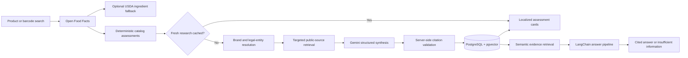
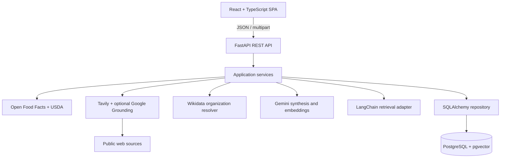

# JustSupply

**An evidence-first product research platform for ethical purchasing decisions.**

JustSupply helps consumers investigate what sits behind everyday product claims. Search by product
name, brand, or barcode to review vegan composition, environmental impact, fair pay and
opportunities for women, and the inclusion of historically excluded groups.

Instead of producing an opaque ethical score, JustSupply keeps every dimension separate, links
findings to their sources, and makes missing or conflicting information visible. Generative AI is
used to organize and explain evidence—not to replace it.

> JustSupply does not certify products or declare a universal “best” choice. It helps people inspect
> available evidence and decide according to their own priorities.

## At a glance

| Product | Engineering |
| --- | --- |
| Search by name, brand, or barcode | React 19 + TypeScript single-page application |
| Product image and catalog information | FastAPI + Pydantic typed REST API |
| Four independent ethical assessments | PostgreSQL + SQLAlchemy + Alembic |
| Automatic public-source research | Gemini structured generation + Tavily retrieval |
| Questions answered with citations | LangChain RAG + pgvector semantic search |
| Community reports with optional supporting material | Validated image and document uploads |
| English, Portuguese, and Spanish | Persisted localized findings and locale-aware UI |
| Explicit uncertainty and provenance | Server-side citation and trust validation |

This portfolio project demonstrates full-stack software engineering with a particular focus on AI
engineering, retrieval-augmented generation, resilient external integrations, data provenance, and
responsible product design.

## The problem

Terms such as *vegan*, *sustainable*, and *inclusive* are useful, but rarely tell the whole story.
Relevant information is fragmented across product catalogs, ingredient lists, certification
registries, corporate disclosures, regulators, equality benchmarks, and journalism.

The available evidence can also differ in scope:

- an ingredient list describes a specific product;
- packaging and environmental indicators may apply to one formulation or market;
- employment and pay disclosures usually apply to a legal company or parent organization;
- a policy proves that a policy was published, not that every workplace outcome is positive;
- silence is missing information, not proof of misconduct.

JustSupply models those distinctions directly instead of compressing them into one unexplained
rating.

## Product experience

### Search and compare evidence

Users can search food products using a name, brand, or 8–14 digit barcode. Results combine Open
Food Facts, an optional USDA FoodData Central fallback, previously persisted catalog data, and
matching community-only submissions.

Every product can display:

- catalog identity, brand, barcode, package image, and update date;
- vegan composition and ingredient concerns;
- environmental indicators and public sustainability evidence;
- representation, leadership, pay equity, and opportunities for women;
- minority and historically excluded-group inclusion;
- product-level versus brand-level scope;
- supporting sources, verification strength, and limitations;
- positive and negative community totals kept separate from researched findings.

### Ask questions about the evidence

After research is available, users can ask product-specific questions. The assistant retrieves
relevant passages from the latest product and brand evidence, answers only from that context, and
links each supported statement back to a source. When the retrieved material cannot support an
answer, the application returns an explicit insufficient-information result instead of guessing.

### Contribute community knowledge

Users can publish an unverified product report with:

- product name and/or barcode;
- one required category from a controlled food taxonomy;
- positive or negative assessments for any known dimensions;
- written observations;
- up to five supporting links;
- an optional product or label photo;
- up to three optional PDF, DOCX, or TXT documents.

Community submissions are reusable in future searches but remain visibly separated from catalog
and researched evidence. Publication does not mean that JustSupply verified the report.

### Use the complete interface in three languages

English is the default language. Brazilian Portuguese and Latin American Spanish are always
available from the header. The selected locale is remembered in the browser.

One research run stores localized findings for all three languages, avoiding repeated web and
model calls when the user changes the interface language. Original source titles and excerpts are
preserved for provenance.

## Evidence model

JustSupply deliberately avoids a single ethical score. Each assessment uses one of five states:

| Status | Meaning |
| --- | --- |
| `supported` | Available evidence supports the finding. |
| `mixed` | Sources or indicators point in different directions. |
| `concern` | A cited source documents a relevant concern. |
| `not_disclosed` | Direct public disclosure was not found. |
| `unknown` | Available information is insufficient for a conclusion. |

The application also records whether evidence applies to the product or brand and whether it comes
from catalog data, one source, multiple sources, or an unverified submission.

Core trust rules are enforced by application code:

- favorable, mixed, and concern findings require at least one valid source reference;
- invalid or out-of-range citations are discarded;
- uncited model claims are downgraded to `unknown` or `not_disclosed`;
- company policies are not presented as measured workforce outcomes;
- regional and industry risks are not presented as proof about a specific product;
- missing disclosure is never converted into evidence of wrongdoing;
- relevant but inconclusive journalism can be shown for inspection without becoming a confirmed
  conclusion.

## AI and RAG workflow

The system separates discovery, synthesis, persistence, retrieval, and answer generation so each
stage remains inspectable and replaceable.


```mermaid
flowchart LR
    A[Product or barcode search] --> B[Open Food Facts]
    B --> C[Optional USDA ingredient fallback]
    B --> D[Deterministic catalog assessments]
    D --> E{Fresh research cached?}
    E -- Yes --> K[Localized assessment cards]
    E -- No --> F[Brand and legal-entity resolution]
    F --> G[Targeted public-source retrieval]
    G --> H[Gemini structured synthesis]
    H --> I[Server-side citation validation]
    I --> J[(PostgreSQL + pgvector)]
    J --> K
    J --> L[Semantic evidence retrieval]
    L --> M[LangChain answer pipeline]
    M --> N[Cited answer or insufficient information]
```

### 1. Deterministic product assessment

Vegan composition does not depend on a model alone. JustSupply combines:

1. Open Food Facts vegan analysis and label tags;
2. structured and raw ingredient lists;
3. multilingual deterministic rules for animal-derived and ambiguous ingredients;
4. USDA branded-food ingredients when primary catalog coverage is weak;
5. certification registries and official pages discovered during research;
6. catalog or user-supplied label images as bounded, product-level visual evidence.

An ingredient list with no obvious animal ingredient is not treated as vegan certification. USDA
ingredient data is never presented as environmental evidence.

### 2. Entity-aware public research

Employment evidence usually belongs to a legal employer rather than the consumer-facing brand.
The organization resolver combines catalog ownership metadata with multilingual Wikidata searches
to identify official names, parent or manufacturer relationships, and jurisdiction.

Ambiguous candidates are scored and filtered by organization and consumer-sector context. For
example, the resolver distinguishes the Brazilian dairy company **Vigor S.A.** from unrelated
organizations that share the word “Vigor.”

Tavily then runs focused searches rather than one broad prompt:

- vegan composition and certification;
- environmental impact, deforestation, climate, water, packaging, and traceability;
- representation and leadership of women;
- pay equity and gender pay gaps;
- equal opportunity, hiring, promotion, and career progression;
- minority inclusion, disability, race and ethnicity, and LGBTQ+ workplace evidence;
- annual, sustainability, ESG, and diversity reports;
- relevant journalism and reported controversies.

Social queries use the resolved jurisdiction to prioritize English, Portuguese, or Spanish search
terms. Before a result reaches Gemini, relevance filters require both a recognized company identity
and dimension-specific language. Code assets, unrelated company reports, generic workforce studies,
and unsupported search matches are rejected.

Government records, public databases, certification registries, company disclosures, independent
benchmarks, and journalism are classified separately so synthesis can weigh each source according
to what it can actually prove.

An optional Google Search Grounding adapter can be enabled alongside Tavily. A composite retriever
merges and deduplicates sources while allowing either provider to fail without discarding valid
results returned by the other.

### 3. Structured multilingual synthesis

Gemini receives source content as untrusted data and returns schema-validated JSON containing
exactly four assessment dimensions, localized findings, limitations, source references, and
optional organization resolution.

Prompt instructions and external evidence are kept in separate boundaries to reduce prompt
injection risk. The backend validates the generated structure and citations before persisting or
displaying any assessment.

### 4. Semantic retrieval and grounded answers

Source passages are embedded with `gemini-embedding-2` into 1,536-dimensional vectors stored in
PostgreSQL through pgvector. HNSW cosine-similarity search retrieves the latest applicable product
and brand evidence.

A LangChain runnable supplies only those passages to the answer generator. Generated citation
numbers are checked against the retrieved context, and unsupported answers are replaced with an
insufficient-information response.

LangChain remains behind an adapter: business rules, persistence, citation validation, and trust
decisions are ordinary application code rather than framework-specific chains.

## Architecture


```mermaid
flowchart TB
    UI[React + TypeScript SPA]
    API[FastAPI REST API]
    SERVICE[Application services]
    CATALOG[Open Food Facts + USDA]
    SEARCH[Tavily + optional Google Grounding]
    ENTITY[Wikidata organization resolver]
    AI[Gemini synthesis and embeddings]
    RAG[LangChain retrieval adapter]
    REPO[SQLAlchemy repository]
    DB[(PostgreSQL + pgvector)]

    UI -->|JSON / multipart| API
    API --> SERVICE
    SERVICE --> CATALOG
    SERVICE --> SEARCH
    SERVICE --> ENTITY
    SERVICE --> AI
    SERVICE --> RAG
    SERVICE --> REPO
    REPO --> DB
    SEARCH --> WEB[Public web sources]
```

### Backend boundaries

- **API routes** validate HTTP input and map domain errors to status codes.
- **Application services** coordinate search, assessment, research, community reports, and Q&A.
- **Integration adapters** isolate every external catalog, search provider, model, and framework.
- **Repositories** own SQLAlchemy queries, persistence, caching, and transaction boundaries.
- **Domain types and Pydantic schemas** define typed contracts between layers.
- **Alembic migrations** version relational and vector schema changes.

### Data design

Products, brands, claims, sources, evidence records, research runs, claim-to-evidence relationships,
catalog snapshots, answer caches, community reports, report outcomes, and attachments are stored as
separate concepts.

This design preserves provenance, allows one source to support multiple findings, shares applicable
brand evidence across products, and avoids unnecessary catalog, search, embedding, and generation
calls.

## Notable engineering decisions

| Decision | Reason |
| --- | --- |
| Separate assessment dimensions | Prevents a positive result in one area from hiding a concern or data gap in another. |
| Product and brand scopes remain explicit | Avoids attributing company-wide evidence to a specific formulation. |
| Retrieval and synthesis are different stages | Keeps source discovery auditable and providers replaceable. |
| Citation validation runs on the server | The model cannot make an unsupported claim valid by formatting it convincingly. |
| Deterministic ingredient rules precede AI synthesis | Common product facts remain explainable, testable, and inexpensive. |
| Brand-to-company resolution precedes social search | Employment disclosures usually use legal entity or parent-company names. |
| Community reports use a separate trust channel | User contributions add coverage without silently changing researched conclusions. |
| LangChain is isolated behind an adapter | Reduces framework lock-in and keeps domain behavior directly testable. |
| Fresh results and answers are persisted | Reduces external API usage, latency, and repeated embedding work. |
| Localized findings are generated once | Switching languages does not trigger another research run. |
| External content is always untrusted | Reduces prompt-injection and provenance risks. |

## Resilience, caching, and validation

- Catalog searches—including empty results—are cached for 24 hours by default.
- Public research is cached for seven days by default and versioned by research strategy.
- Repeated questions are cached against the exact research run, language, and retrieval size.
- A sequential frontend queue prevents broad searches from overwhelming quota-limited providers.
- The composite product catalog falls back to USDA without replacing valid Open Food Facts matches.
- Degraded USDA-only results are not cached, allowing later recovery of primary environmental data.
- Multi-provider web retrieval keeps valid results when one provider is unavailable.
- Label images are checked by MIME type and file signature and limited to 4 MB.
- Report documents are type-checked, size-limited, deduplicated by SHA-256, and downloaded with
  content sniffing disabled.
- User-visible errors avoid exposing infrastructure, provider, or configuration details.

## Technology stack

| Area | Technologies and approaches |
| --- | --- |
| Frontend | React 19, TypeScript 6, Vite, React Router, TanStack Query |
| Backend | Python 3.14, FastAPI, Pydantic, dependency injection |
| Persistence | PostgreSQL 18, SQLAlchemy 2, Alembic migrations |
| Vector search | pgvector, HNSW index, cosine similarity |
| AI | Gemini structured generation, multilingual synthesis, multimodal label analysis |
| Retrieval | Tavily Search, optional Google Search Grounding, relevance filtering |
| RAG | Gemini Embeddings, LangChain Core, citation-constrained answers |
| Product data | Open Food Facts, optional USDA FoodData Central fallback |
| Entity resolution | Open Food Facts ownership metadata, Wikidata |
| Backend quality | pytest, strict MyPy, Ruff |
| Frontend quality | Vitest, Testing Library, oxlint, TypeScript compiler |
| Local infrastructure | Docker Compose |

## Repository structure

```text
JustSupply/
├── backend/
│   ├── justsupply/
│   │   ├── api/             # FastAPI routes
│   │   ├── core/            # Settings and configuration
│   │   ├── database/        # Models, sessions, and Alembic migrations
│   │   ├── domain/          # Framework-independent research types
│   │   ├── integrations/    # Catalog, search, Gemini, Wikidata, and RAG adapters
│   │   ├── repositories/    # SQLAlchemy persistence
│   │   ├── schemas/         # Pydantic request and response contracts
│   │   └── services/        # Application use cases and business rules
│   └── tests/               # Unit and PostgreSQL integration tests
├── frontend/
│   └── src/
│       ├── api/             # Typed API client
│       ├── components/      # Product, assessment, Q&A, and report components
│       ├── pages/           # Search and community-report pages
│       └── i18n.tsx         # English, Portuguese, and Spanish dictionaries
├── compose.yaml             # Local PostgreSQL + pgvector
├── pyproject.toml           # Python package, dependencies, and quality tooling
└── README.md
```

## API overview

| Method | Endpoint | Purpose |
| --- | --- | --- |
| `GET` | `/health` | Liveness check. |
| `GET` | `/health/ready` | Database readiness check. |
| `GET` | `/api/v1/consumer/products` | Search catalog and community products. |
| `POST` | `/api/v1/consumer/products/{barcode}/research` | Run or reuse public-source research. |
| `POST` | `/api/v1/consumer/products/{barcode}/research-label` | Research an uploaded label image. |
| `GET` | `/api/v1/consumer/label-images/{image_id}` | Read a stored label image. |
| `POST` | `/api/v1/consumer/products/{barcode}/ask` | Ask a question over retrieved evidence. |
| `GET` | `/api/v1/consumer/reports` | Browse and filter public community reports. |
| `POST` | `/api/v1/consumer/reports` | Publish an unverified community report. |
| `GET` | `/api/v1/consumer/reports/{report_id}/photo` | Read an optional report photo. |
| `GET` | `/api/v1/consumer/reports/{report_id}/documents/{attachment_id}` | Download supporting material. |

Search and research support `en`, `pt-BR`, and `es-419`. Interactive OpenAPI documentation is
available at `http://127.0.0.1:8000/docs` while the API is running.

## Run locally

### Prerequisites

- Python 3.14;
- Node.js and npm;
- Docker Desktop;
- a Gemini API key;
- a Tavily API key;
- optionally, a data.gov key for USDA FoodData Central.

### 1. Configure environment variables

```powershell
Copy-Item .env.example .env
```

Add keys only to the local `.env` file:

```dotenv
GEMINI_API_KEY=your-key-here
TAVILY_API_KEY=your-key-here
USDA_API_KEY=your-optional-data-gov-key
```

Never commit `.env` or expose provider credentials to the frontend.

### 2. Install the backend

```powershell
python -m venv .venv
.\.venv\Scripts\Activate.ps1
python -m pip install --editable ".[dev]"
```

### 3. Start PostgreSQL and apply migrations

```powershell
docker compose up -d database
python -m alembic upgrade head
```

PostgreSQL is exposed locally on port `5433` to avoid conflicts with a default local installation.

### 4. Start the API

```powershell
python -m uvicorn justsupply.main:app --reload
```

### 5. Start the frontend

Open another terminal:

```powershell
Set-Location frontend
npm install
npm run dev
```

Open `http://localhost:5173`.

## Quality checks

Backend:

```powershell
python -m ruff format --check backend
python -m ruff check backend
python -m mypy backend\justsupply
python -m pytest
```

PostgreSQL and pgvector integration tests:

```powershell
$env:RUN_DATABASE_TESTS = "1"
python -m pytest backend\tests\integration
Remove-Item Env:RUN_DATABASE_TESTS
```

Frontend:

```powershell
Set-Location frontend
npm run lint
npm run test:run
npm run build
```

## Current scope and trade-offs

The current MVP focuses on food products and public evidence. Important limitations are explicit:

- Open Food Facts and community reports may be incomplete or outdated.
- Public sources can conflict or cover only one market, legal entity, or reporting period.
- Company disclosures are self-reported unless independently corroborated.
- Search coverage is not proof that information does or does not exist.
- Community reports are intentionally unverified and currently have no authentication or reviewer
  workflow.
- Uploaded files are stored in PostgreSQL for the MVP; production deployment would benefit from
  object storage, malware scanning, retention controls, and authenticated moderation.
- External-provider latency and quotas affect uncached research.

## Roadmap

- authentication and role-based moderation;
- automated evaluation datasets for retrieval quality and grounded-answer faithfulness;
- observability for provider latency, token usage, cost, and retrieval rejection reasons;
- dedicated certification and employment-data adapters;
- background processing for long-running research and file analysis;
- CI/CD and public deployment;
- broader catalogs for cosmetics, household products, clothing, and electronics.

The evidence model is intentionally broader than food so future industries can reuse the same
claims, provenance, entity-resolution, and RAG foundations.

## Responsible AI principles

- A model output is never stored as the source of its own claim.
- Public pages and product metadata are treated as untrusted input.
- Findings remain traceable to original URLs and excerpts.
- Product, brand, company, and jurisdiction scopes remain distinct.
- Uncertainty is displayed rather than hidden behind confident prose.
- Consumers are encouraged to inspect original sources before important decisions.

## Data and API references

- [Open Food Facts API](https://openfoodfacts.github.io/documentation/docs/Product-Opener/api/)
- [USDA FoodData Central API](https://fdc.nal.usda.gov/fdc/v1/)
- [Wikidata API](https://www.wikidata.org/w/api.php)
- [Tavily Search API](https://docs.tavily.com/documentation/api-reference/endpoint/search)
- [Gemini text generation](https://ai.google.dev/gemini-api/docs/text-generation)
- [Gemini embeddings](https://ai.google.dev/gemini-api/docs/embeddings)
- [Gemini Google Search Grounding](https://ai.google.dev/gemini-api/docs/google-search)
- [UK Gender Pay Gap data](https://gender-pay-gap.service.gov.uk/Viewing/download)
- [Australian WGEA data](https://www.wgea.gov.au/data-statistics)
- [The Vegan Society trademark search](https://www.vegansociety.com/resources/lifestyle/shopping/trademark-search)
- [Vegan Action certification information](https://vegan.org/certification/consumer-info)
