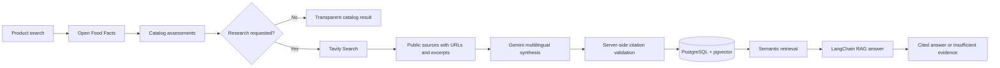
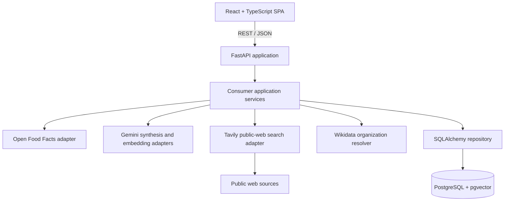

# JustSupply

**Evidence-first product research for more informed purchasing decisions.**

JustSupply is a multilingual consumer application that helps people investigate the ethical and
environmental context behind everyday products. A user can search by product name, brand, or
barcode, inspect the product photo, and review separate findings about vegan composition,
environmental impact, women in the workforce, and the inclusion of historically excluded groups.

The project combines structured product data, live public-web research, and retrieval-augmented
generation (RAG). Its central principle is simple: an AI-generated statement is not evidence by
itself. Every meaningful conclusion must show where it came from, how strong its support is, and
what remains unknown.

> JustSupply does not certify products or declare a universal "best" choice. It organizes public
> evidence so that consumers can make decisions according to their own priorities.

## Why this project exists

Labels such as *vegan*, *sustainable*, or *inclusive* are useful, but they rarely tell the whole
story. Relevant information is fragmented across product databases, certification registries,
company disclosures, NGO reports, regulators, and journalism. Social and environmental claims may
also be incomplete, outdated, broad enough to apply only to a brand, or supported exclusively by
the company making the claim.

JustSupply was created to make that uncertainty visible instead of hiding it behind an opaque
score. The application is designed around four motivations:

- make public evidence easier for non-specialists to inspect;
- separate product facts from brand-level policies and disclosures;
- distinguish a documented concern from information that is simply unavailable;
- use generative AI for research and explanation without treating model output as a source.

## What users can do

1. Search for a food product by name, brand, or 8–14 digit barcode across Open Food Facts and
   persisted JustSupply community submissions.
2. See its catalog identity, brand, package image, update date, automated evidence, and separate
   positive and negative community totals.
3. Review independent assessment cards for:
   - vegan composition;
   - environmental impact;
   - employment and advancement of women;
   - inclusion of minorities and historically excluded groups.
4. Start on-demand public-source research for a selected product and brand.
5. Open every cited public source and inspect limitations attached to each finding.
6. Ask a specific question through a RAG assistant that answers only from retrieved evidence.
7. Submit a community assessment by product name or barcode, reporting yes or no for vegan
   composition, sustainability, support for women, and support for minorities. Users may answer
   only the dimensions they know, select a normalized food category, and add observations, a source
   link, photo, or documents.
8. Browse public community reports, filter them by food category or from a product result, and
   inspect their attached photos, source links, and documents under an explicit unverified-content
   warning.
9. Use the entire experience in English, Brazilian Portuguese, or Latin American Spanish.

English is the default language. The language selector is always available in the header, and the
preference is remembered locally. A single research run creates all three localized versions, so
changing the interface language does not repeat the web research or consume another research
request. Source titles and excerpts remain in their original language to preserve provenance.

## How evidence is presented

JustSupply deliberately avoids a single ethical score. Each dimension has its own status:

| Status | Meaning |
| --- | --- |
| `supported` | Available evidence supports the finding. |
| `mixed` | Sources or indicators point in different directions. |
| `concern` | A cited source documents a relevant concern. |
| `not_disclosed` | Direct public disclosure was not found. |
| `unknown` | Available data is insufficient to reach a conclusion. |

Every result also communicates its evidence scope and verification level:

- **Product-level evidence** concerns that specific formulation, package, or certification.
- **Brand-level evidence** concerns policies, employment, leadership, or company-wide reporting.
- **Catalog data** comes from the community-maintained Open Food Facts database.
- **Single source** means corroboration is limited.
- **Multiple sources** indicates broader public support.
- **Unverified** means no valid public source was attached to the claim.

Missing disclosure is never converted into evidence of wrongdoing, and a general brand or regional
risk is never presented as proof about a specific product.

For vegan composition, JustSupply uses a layered fallback instead of relying on one catalog flag:

1. Open Food Facts vegan analysis and label tags;
2. structured and raw ingredient lists checked by deterministic multilingual rules;
3. explicit identification of animal-derived and ambiguous ingredients;
4. public vegan-certification registries and official product pages found during research;
5. the public ingredient-label image, when Open Food Facts has an image but no usable ingredient
   text, supplied to Gemini as multimodal evidence.
6. an optional JPEG, PNG, or WebP ingredient-label photo uploaded by the user (maximum 4 MB),
   stored with the product so the cited visual evidence remains inspectable.

An ingredient list with no obvious animal ingredient is still not treated as certification.

## Environmental research

The first environmental signals come from the Open Food Facts Green-Score and Forest Footprint
attributes when they are available.
The optional Tavily retrieval and Gemini synthesis look for product- or brand-relevant public
evidence involving:

- deforestation and land-use risk;
- climate and greenhouse-gas impact;
- water use and water-related risks;
- packaging and recyclability;
- sustainability commitments and independently documented progress;
- supply-chain origin and traceability.

When no product-specific evidence exists, JustSupply reports that limitation instead of inferring a
negative conclusion from a country, commodity, or industry-level risk.

## AI and RAG design

The AI workflow uses two distinct stages so that collection and interpretation remain auditable.


```mermaid
flowchart LR
    A[Product search] --> B[Open Food Facts]
    B --> C[Catalog assessments]
    C --> D{Research requested?}
    D -- No --> E[Transparent catalog result]
    D -- Yes --> F[Tavily Search]
    F --> G[Public sources with URLs and excerpts]
    G --> H[Gemini multilingual synthesis]
    H --> I[Server-side citation validation]
    I --> J[(PostgreSQL + pgvector)]
    J --> K[Semantic retrieval]
    K --> L[LangChain RAG answer]
    L --> M[Cited answer or insufficient evidence]
```

### Public-source research

Before social retrieval, JustSupply combines Open Food Facts ownership metadata with Wikidata's
owner, parent-organization, and manufacturer relationships. This turns a consumer brand such as
Nescafé into the reporting organization, Nestlé, without asking Gemini to guess the relationship.
Tavily then runs separate searches for vegan composition, environmental impact, women workers, and
minority inclusion. Social retrieval searches both the brand and resolved organizations, using
dedicated queries for government/benchmark records and deeper PDF searches for annual, ESG,
sustainability, and diversity reports. Discoverable targets include UK Gender Pay Gap reporting,
WGEA, SEC filings, EEOC, HRC, and Disability:IN data. Gemini then
receives those sources as untrusted evidence and produces exactly four structured assessment
dimensions. Separating retrieval from generation keeps the source trail independent from the
language model and allows each provider to be tested or replaced independently. The server, not
the model, enforces the trust rules:

- positive, mixed, or concern findings require at least one valid source reference;
- source numbers outside the grounded result are discarded;
- uncited assertions are downgraded to `unknown` or `not_disclosed`;
- product and brand scopes remain explicit;
- a cited entity-resolution record connects a consumer brand to its legal reporting entity,
  parent company, and jurisdiction when sources support that mapping;
- obvious social-media and document-hosting domains are excluded, while every retained source is
  classified as government, certification registry, public database, company disclosure,
  independent benchmark, or unclassified;
- evidence limitations are stored with the claim;
- research is cached for seven days by default.
- catalog searches, including empty results, are cached for 24 hours by default;
- repeated RAG questions are cached against the exact research run, language, and retrieval size;
- the newest women-workforce and minority-inclusion evidence is shared across products connected
  to the same normalized brand.

### Evidence-grounded questions

Grounded passages are embedded with `gemini-embedding-2` using 1,536-dimensional vectors and stored
in PostgreSQL through pgvector. For each question:

1. the question is embedded in the selected language;
2. cosine similarity retrieves evidence from the latest product research and the newest applicable
   brand research;
3. a LangChain runnable provides only those passages to Gemini;
4. the generated response must cite retrieved evidence as `[1]`, `[2]`, and so on;
5. the server rejects citation numbers outside the retrieved context;
6. a response with no valid support becomes an explicit insufficient-evidence result;
7. the grounded response is cached until a newer research run changes its evidence context.

LangChain is kept behind an integration adapter. Business rules, citation validation, persistence,
and trust decisions remain ordinary application code, making them easier to test and reducing
framework lock-in.

## Architecture


```mermaid
flowchart TB
    UI[React + TypeScript SPA]
    API[FastAPI application]
    CATALOG[Open Food Facts adapter]
    AI[Gemini synthesis and embedding adapters]
    SEARCH[Tavily public-web search adapter]
    ENTITY[Wikidata organization resolver]
    SERVICE[Consumer application services]
    REPO[SQLAlchemy repository]
    DB[(PostgreSQL + pgvector)]

    UI -->|REST / JSON| API
    API --> SERVICE
    SERVICE --> CATALOG
    SERVICE --> SEARCH
    SERVICE --> ENTITY
    SERVICE --> AI
    SERVICE --> REPO
    REPO --> DB
    SEARCH --> WEB[Public web sources]
```

The backend follows clear boundaries:

- **API routes** handle HTTP validation and status-code mapping.
- **Application services** coordinate search, assessment, research, and RAG use cases.
- **Integration adapters** isolate Open Food Facts, Gemini, embeddings, and LangChain.
- **Repositories** own persistence queries and transaction boundaries.
- **Pydantic schemas and domain types** define contracts between layers.
- **Alembic migrations** version the PostgreSQL and pgvector schema.

The evidence model stores products, brands, claims, public sources, evidence records, research runs,
claim-to-evidence relationships, catalog search snapshots, and grounded-answer cache entries
separately. This retains provenance, allows one source to support multiple conclusions, and avoids
unnecessary catalog, embedding, and generation calls.

Community reports are stored independently from verified claims. One report can provide a positive
or negative answer for any combination of the four assessment dimensions, and future searches reuse
the persisted positive and negative totals without an AI or web-search call. Structurally valid
submissions are published with the `published_unverified` status and can be
browsed on a dedicated public page or through a product-specific link. The interface always labels
these entries as personal community accounts: publication does not mean that JustSupply verified
the allegation, and a report cannot automatically change a product assessment. The data model also
supports `pending_review` and `rejected` for a future moderation workflow.

Every report has one required category selected from a controlled food taxonomy, including
beverages, biscuits and cookies, yogurt, snacks and chips, ice cream, chocolate, ready meals, and
other common groups. Controlled values prevent spelling variants from fragmenting filters. The main
search merges catalog results with matching community-only products, while keeping automated
assessments and community totals visually and structurally separate.

Supporting documents are stored in a separate attachment table and deduplicated per report by
SHA-256 hash. The API accepts up to three validated PDF, DOCX, or UTF-8 text files of 8 MB each.
Attachments are exposed only through opaque report and attachment identifiers, downloaded as
attachments with browser content sniffing disabled, and are not sent to Gemini automatically.
Sources and files remain optional so people can still contribute incomplete knowledge, but the
interface recommends them because they make a report easier for readers to evaluate.

User-supplied label images are validated by MIME type and file signature, limited to 4 MB, stored in
PostgreSQL under an opaque UUID, and used only as product-level evidence. Authentication and a
retention/deletion policy are required before treating this upload path as production-ready for
personal or sensitive images; users should upload a cropped package label only.

## Engineering highlights

This project demonstrates practical full-stack and AI engineering skills, including:

- a typed REST API with FastAPI, Pydantic, and dependency injection;
- a responsive React 19 and TypeScript interface;
- server-state synchronization and mutations with TanStack Query;
- PostgreSQL persistence with SQLAlchemy and versioned Alembic migrations;
- vector storage and HNSW cosine-similarity search with pgvector;
- Tavily public-web retrieval with citable URLs and source excerpts;
- Gemini schema-validated multilingual synthesis and embeddings;
- RAG orchestration through LangChain Core without coupling domain rules to the framework;
- defensive citation validation and explicit insufficient-evidence behavior;
- prompt-injection-aware separation of instructions and untrusted product/evidence content;
- multilingual UI, stored AI findings, locale-aware dates, and locale-aware RAG answers;
- adapters and test doubles for deterministic unit tests;
- PostgreSQL integration tests for persistence and vector retrieval;
- normalized, moderation-ready community assessments with positive and negative outcomes,
  controlled food categories, optional supporting material, localized warnings, category filters,
  and main-search integration;
- static typing, automated formatting, linting, unit tests, and production frontend builds.

## Technology stack

| Area | Technologies |
| --- | --- |
| Frontend | React 19, TypeScript, Vite, React Router, TanStack Query |
| Backend | Python 3.14, FastAPI, Pydantic, SQLAlchemy |
| AI | Gemini API, schema-validated outputs, multilingual synthesis, Gemini Embeddings |
| Web retrieval | Tavily Search API |
| Entity resolution | Open Food Facts ownership data, Wikidata |
| RAG | LangChain Core, pgvector, HNSW cosine similarity |
| Data | PostgreSQL 18, Alembic, Open Food Facts |
| Quality | pytest, MyPy strict mode, Ruff, Vitest, Testing Library, oxlint |
| Local infrastructure | Docker Compose |

The local free-tier default is `gemini-3.1-flash-lite` with low reasoning effort to reduce latency
and capacity errors. The model remains configurable through `JUSTSUPPLY_GEMINI_MODEL`, and calls
have a configurable timeout so provider congestion does not leave requests hanging indefinitely.

## API overview

| Method | Endpoint | Purpose |
| --- | --- | --- |
| `GET` | `/health` | Service health check. |
| `GET` | `/api/v1/consumer/products` | Search catalog and community products by name, brand, or barcode. |
| `GET` | `/api/v1/consumer/reports` | List unverified reports, optionally filtered by product or category. |
| `POST` | `/api/v1/consumer/reports` | Publish an unverified categorized community assessment. |
| `GET` | `/api/v1/consumer/reports/{report_id}/photo` | Read the optional report photo. |
| `GET` | `/api/v1/consumer/reports/{report_id}/documents/{attachment_id}` | Download a supporting document. |
| `POST` | `/api/v1/consumer/products/{barcode}/research` | Run or reuse cited public-source research. |
| `POST` | `/api/v1/consumer/products/{barcode}/ask` | Retrieve evidence and generate a cited answer. |

Search and research accept `language=en`, `language=pt-BR`, or `language=es-419`. The question
request body accepts the same `language` field. Use `refresh=true` on the research endpoint to
bypass a fresh cached result.

Interactive API documentation is available at `http://127.0.0.1:8000/docs` while the backend is
running.

## Run locally

### Prerequisites

- Python 3.14;
- Node.js and npm;
- Docker Desktop;
- a Gemini API key for evidence synthesis, embeddings, and RAG answers;
- optionally, a Tavily API key for higher public-web retrieval limits.

Catalog search remains available without Gemini, while AI research and questions return a clear
configuration error.

### 1. Configure the environment

```powershell
Copy-Item .env.example .env
```

Add the Gemini key only to the local `.env` file. Tavily works in free rate-limited keyless mode;
an optional free Tavily account increases the monthly allowance:

```dotenv
GEMINI_API_KEY=your-key-here
TAVILY_API_KEY=your-key-here
```

The Tavily free account currently includes 1,000 monthly API credits without requiring a credit
card. Leave `TAVILY_API_KEY` empty to use the lower-limit keyless mode during local development.

Never commit `.env` or expose the key to the frontend.

### 2. Install the backend

Activate the virtual environment and run:

```powershell
python -m pip install --editable ".[dev]"
```

### 3. Start PostgreSQL and apply migrations

```powershell
docker compose up -d database
python -m alembic upgrade head
```

The local PostgreSQL service is exposed on port `5433` to avoid a common conflict with locally
installed PostgreSQL instances.

### 4. Start the API

```powershell
python -m uvicorn justsupply.main:app --reload
```

### 5. Start the frontend

In another terminal:

```powershell
Set-Location frontend
npm install
npm run dev
```

Open `http://localhost:5173`.

## Quality checks

Backend:

```powershell
python -m ruff format --check backend
python -m ruff check backend
python -m mypy backend\justsupply
python -m pytest backend\tests
```

PostgreSQL and pgvector integration test:

```powershell
$env:RUN_DATABASE_TESTS = "1"
python -m pytest backend\tests\integration
Remove-Item Env:RUN_DATABASE_TESTS
```

Frontend:

```powershell
Set-Location frontend
npm test -- --run
npm run lint
npm run build
```

## Current scope and next steps

The current MVP focuses on food-product discovery and evidence-backed explanations. Likely next
steps include broader product catalogs, dedicated certification-registry integrations, richer
environmental dimensions, automated evaluation datasets for retrieval and grounded answers,
authentication, observability for model latency and cost, CI/CD, and public deployment.

The architecture intentionally keeps the evidence model broader than food so that future modules
for cosmetics, household products, clothing, and electronics can reuse the same provenance and RAG
foundations.

## Data and AI responsibility

- Open Food Facts is community maintained and may be incomplete or outdated.
- Public web sources can conflict or describe only a brand-level policy.
- Tavily discovers sources, while Gemini summarizes evidence but is never stored as the source of
  its own claim.
- JustSupply displays uncertainty and source limitations instead of concealing them.
- Consumers should inspect the original sources before making important decisions.

Official references:

- [Open Food Facts API documentation](https://openfoodfacts.github.io/documentation/docs/Product-Opener/api/)
- [Open Food Facts product schema](https://openfoodfacts.github.io/documentation/docs/Product-Opener/schemas/schemas/product/)
- [The Vegan Society trademark search](https://www.vegansociety.com/resources/lifestyle/shopping/trademark-search)
- [Vegan Action certified product information](https://vegan.org/certification/consumer-info)
- [UK Gender Pay Gap downloads](https://gender-pay-gap.service.gov.uk/Viewing/download)
- [Australian WGEA data](https://www.wgea.gov.au/data-statistics)
- [SEC EDGAR APIs](https://www.sec.gov/search-filings/edgar-application-programming-interfaces)
- [HRC employer equality search](https://www.hrc.org/resources/employers)
- [Wikidata API](https://www.wikidata.org/w/api.php)
- [Tavily Search API](https://docs.tavily.com/documentation/api-reference/endpoint/search)
- [Gemini text generation](https://ai.google.dev/gemini-api/docs/text-generation)
- [Gemini embeddings](https://ai.google.dev/gemini-api/docs/embeddings)
